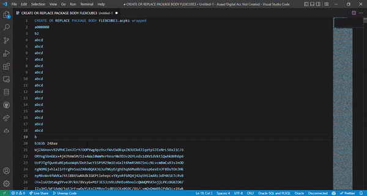

# PL/SQL Unwrapper

PL/SQL unwrapper is a simple extension for vs-code which let you unwrap the wrapped oracle pl/sql code.

## Features

This extension uses https://www.codecrete.net/UnwrapIt/ website to unwrap the code. The main feature of this extension to skip the need to copy the code to the website, unwrapping it and coppying it back to your editor. You can use `ctrl+shift+u` or click on unwrap option on status bar at the bottom of your editor to unwrap the code.

You can use `ctrl+alt+u` to remove extra newlines from code.

Sample:

> Tip: You can use unwrap code command from command pallete or click on unwrap option in status bar or use `ctrl+shift+u` key to unwrap code. You can also change shortcut key in settings.

## Requirements

None

## Known Issues

1. Unwrapping will through an error in case the wrapped code is corrupted.
2. An active internet connection is required to unwrap the code.

## Release Notes

### 0.0.1

Initial release of PL/SQL unwrapper

### 0.0.2

Updated the Readme file and extension icon

### 0.0.3

Added format command to the command pallete

## Report an issue

You can raise issues on https://github.com/hammad11ali/PLSQL-Unwrapper in case you find any bugs in the extension.

---

Special thanks to the creator of https://www.codecrete.net/UnwrapIt/ which made the creation of this extension possible

Extension icon by https://icons8.com/
